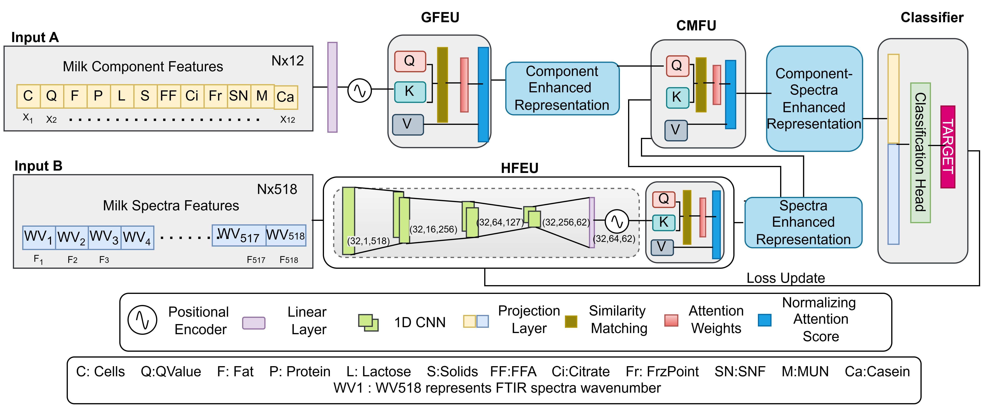

# ADXpertNet: Deep Learning Approach for capturing local and global spatial relationship between FTIR spectra and component data of milk for adulterant detection

[](LICENSE)
[](https://www.python.org/)
[](https://pytorch.org/)


<p align="center">
  
</p>

## Contributions

- **Real-world food-safety problem**: Adulterant Detection

- **Multimodal Perspective**: Rather than treating FTIR spectra and component indicators separately, the paper attempts to model their correlation and complementary information.
Demonstrating a strong latent relationship between FTIR spectral representations and milk compositional parameters through PCA-based correlation analysis, motivating the integration of both modalities.

- **ADXpertNet**: It extracts both global and local enhanced representations from milk spectra and component data separately and fuses them to capture meaningful features and complex relationships between the two modalities. The framework offers a novel perspective on bridging the gap between modalities by representing spectral data as sequential rather than image data.

- **Implementation and Evaluation**: Comprehensive experiments on four publicly available datasets demonstrate that ADXpertNet consistently outperforms benchmark models and baseline approaches. Our paper includes a reasonably broad experimental evaluation, including binary and multi-class classification, comparisons with several ML/DL baselines, robustness analysis with noise injection, and some cross-domain/generalization experiments.

## Dataset 

## Dataset Source and Attribution

The dataset included in this repository is derived from a publicly available dataset originally released by the respective authors.

To facilitate reproducibility and compatibility with our framework, we provide a processed version of the dataset. The released version retains the original data records but excludes a subset of columns that were not required for our experiments.

We gratefully acknowledge the original dataset creators for making the data publicly available.

**Original Dataset Source:**

* Authors: Habib Asseiss Neto et al.
* URL: [\[Original Dataset URL\]](https://static-content.springer.com/esm/art%3A10.1186%2Fs13040-019-0200-5/MediaObjects/13040_2019_200_MOESM2_ESM.csv)
* Citation: Neto, Habib Asseiss, et al. "On the utilization of deep and ensemble learning to detect milk adulteration." BioData Mining 12.1 (2019): 13.

Users of this repository should cite both the original dataset publication and our work when using the processed dataset provided here.

## Environment Setup

### Requirements

- Python 3.10+
- PyTorch 2.6.0+ (CPU or CUDA-enabled GPU)
- Cuda 12.4
- Visual Studio

### Installation

```bash
# Clone the repository
git clone https://github.com/AnupamaBITS/ADXpertNet.git
cd ADXpertNet

# Create and activate a conda environment
conda create -n adxpertnet python=3.10 -y
conda activate adxpertnet

```
## Citation

> **Note:** This paper has been accepted at **ECML PKDD 2026** and is not yet available through Springer. The citation information will be updated upon official publication.

If you use **ADXpertNet** or the accompanying benchmarking code in your research, please cite:

```bibtex
@inproceedings{adxpertnet,
  title     = {ADXpertNet: Deep Learning Approach for Capturing Local and Global Spatial Relationships Between FTIR Spectra and Component Data of Milk for Adulterant Detection},
  author    = {Anupama, Goyal Poonam, Chen Phoebe Ping-Yi, Desai Aniruddha, Dhanabalan Sundar Shanmuga and Goyal, Navneet},
  booktitle = {Proceedings of the European Conference on Machine Learning and Principles and Practice of Knowledge Discovery in Databases (ECML PKDD)},
  year      = {2026},
  volume    = {TBD}
}
```